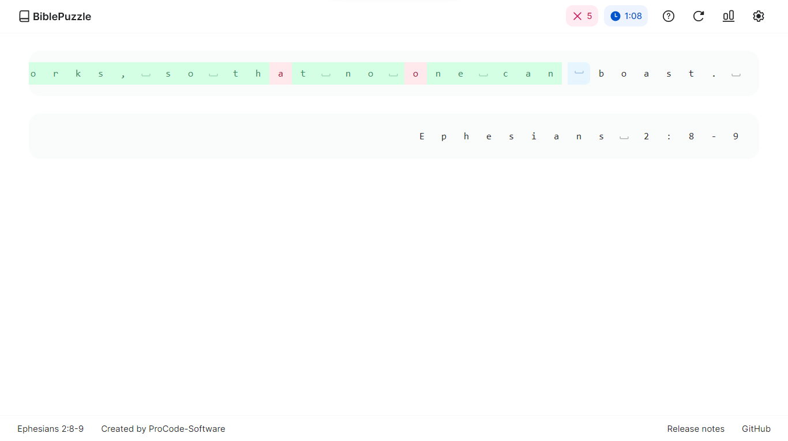
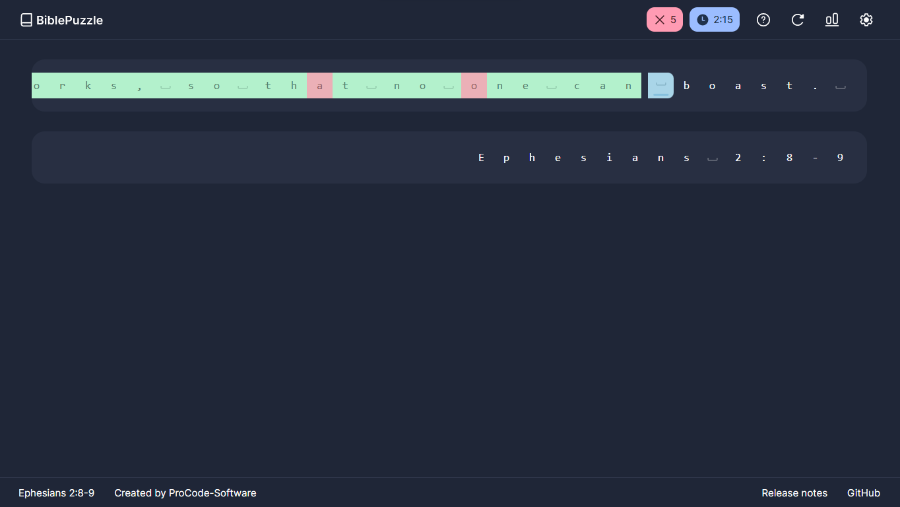

# BiblePuzzle

**A typing game on Bible verses. It's just like Typing.com but using Bible verses.**

### Play now:

https://ProCode-Software.github.io/BiblePuzzle/

## Features
- 📐 **Modern look** so that you can focus on typing
- 🌗 **Dark mode** for night typing
- ✝️ **Bible verse** practice to help you learn the Bible
- 🎨 **Highly customizable** app
- 🅰️ **Trouble keys** to help you see what keys you have trouble typing
- ⚡ **Characters per second tracker** to see how fast you type
- 📊 **Gradebook** showing your last typed verses
- 📒 Organize verses and notes with **Journals**
- ♿ **Accessible** for everyone

## Typing.com vs BiblePuzzle
| |BiblePuzzle |[Typing.com](https://typing.com)|
|--- | --- | ---|
|Trouble keys | ✅ | ✅ |
|Customizable interface | ✅ | ➖ |
|Accessibility features | ✅ | ❌ |
|Gradebook | ✅ | ❌ |
|Dark mode | ✅ | ❌ |
|Bible verse practice | ✅ | ❌ |
|Journal | ✅ | ❌ |

### Screenshots

Dark:

Last updated:  `May 16, 2023`

Created by [ProCode Software](https://github.com/ProCode-Software)

https://ProCode-Software.github.io/BiblePuzzle/
